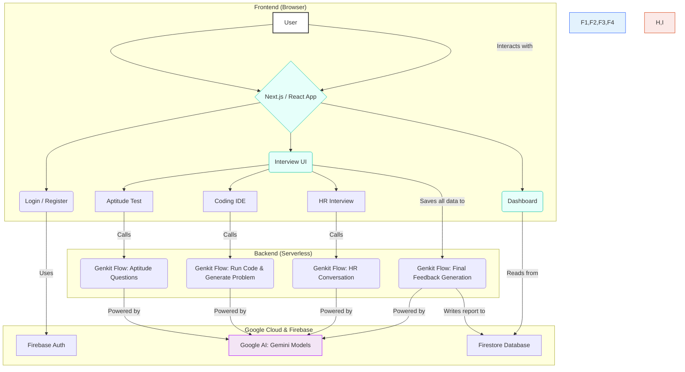

# AI-Powered Mock Interview Platform: Architecture Overview

This document provides a high-level overview of the application's architecture and includes a core code sample. It is designed to be a reference for explaining the project's structure and logic.

## 1. System Architecture Diagram

The application is built on a modern, decoupled architecture that separates the frontend presentation layer from the backend AI and data services.



### Architectural Layers:

1.  **Frontend (Next.js/React)**: A fully interactive client-side application that handles all UI rendering and user interaction. It manages the state of the interview and communicates with the backend services.

2.  **AI Orchestration (Genkit)**: A serverless layer of "AI flows" that encapsulates all business logic involving generative AI. These flows are written in TypeScript and are responsible for generating questions, evaluating answers, and creating the final feedback report. This decouples the AI logic from the frontend, making it modular and easy to maintain.

3.  **Backend Services (Firebase & Google AI)**:
    *   **Firebase Authentication** provides a secure and managed user login system.
    *   **Firestore** acts as the single source of truth, storing user profiles and all data related to each interview session in real-time.
    *   **Google Gemini** is the underlying large language model (LLM) that powers all the generative features within the Genkit flows.

---

## 2. Core Code Example: The Final Feedback Flow

If an interviewer asks to see a piece of code, this is the perfect example. It showcases how data from different parts of the application is aggregated and used in a structured AI prompt to produce a complex, valuable output.

This flow, `provideDetailedFeedback`, is the final step in the interview process. It takes all the performance data, sends it to the AI, and generates the final report.

**File:** `src/ai/flows/provide-detailed-feedback.ts`

```typescript
'use server';

/**
 * @fileOverview A flow for providing detailed feedback to candidates after a mock interview.
 */

import {ai} from '@/ai/genkit';
import {z} from 'genkit';

// 1. Define the exact data structure (schema) the flow will receive.
// This includes scores from other rounds and the HR conversation transcript.
const ProvideDetailedFeedbackInputSchema = z.object({
  aptitudeScore: z.number().optional().describe("The candidate's score in the aptitude round (out of 100)."),
  codingScore: z.number().optional().describe("The candidate's score in the coding round (out of 100)."),
  hrConversation: z.array(z.object({
    speaker: z.enum(['user', 'ai']),
    text: z.string(),
  })).optional().describe('The transcript of the HR interview.'),
  proctoringAnalysis: z.object({
      confidenceLevel: z.number(),
      engagementLevel: z.number(),
      malpracticeDetected: z.boolean(),
      tabSwitches: z.number(),
      proctoringSummary: z.string(),
  }).optional().describe('Analysis of proctoring data, including video analysis and tab switching.'),
});

// 2. Define the exact data structure the flow will return.
// This ensures the AI's output is always predictable and easy to use on the frontend.
const ProvideDetailedFeedbackOutputSchema = z.object({
  feedbackReport: z.string().describe('A concise feedback report in Markdown with a few key strengths and areas for improvement.'),
  overallScore: z.number().describe("The candidate's overall weighted score for the entire interview (out of 100)."),
});


// This is the main function the client-side code will call.
export async function provideDetailedFeedback(
  input: z.infer<typeof ProvideDetailedFeedbackInputSchema>
): Promise<z.infer<typeof ProvideDetailedFeedbackOutputSchema>> {
  return provideDetailedFeedbackFlow(input);
}


// 3. Define the prompt template that will be sent to the Gemini AI model.
// Using Handlebars syntax ({{...}}), we inject the dynamic data into the prompt.
const prompt = ai.definePrompt({
  name: 'provideDetailedFeedbackPrompt',
  input: {schema: ProvideDetailedFeedbackInputSchema},
  output: {schema: ProvideDetailedFeedbackOutputSchema},
  prompt: `You are an AI career coach providing concise, actionable feedback after a mock interview.

  **Candidate's Performance Data:**
  - Aptitude Score: {{aptitudeScore}}%
  - Coding Score: {{codingScore}}%
  {{#if proctoringAnalysis}}
  - Proctoring Flags: {{proctoringAnalysis.tabSwitches}} tab switches. {{proctoringAnalysis.proctoringSummary}}
  {{/if}}
  - HR Interview Transcript:
  {{#each hrConversation}}
    {{#if (eq speaker 'user')}}Candidate: {{else}}Interviewer: {{/if}}{{{text}}}
  {{/each}}

  **Your Task:**

  1.  **Calculate Overall Score:**
      - Weighting: HR (40%), Coding (30%), Aptitude (30%).
      - Analyze the HR transcript for clarity, confidence, and relevance to determine a score out of 100.
      - Apply a penalty for proctoring flags (e.g., -10 points for tab switches).
      - Calculate the final weighted score.

  2.  **Generate Feedback Report (Markdown):**
      - **### Key Strengths:** List 2-3 bullet points on what the candidate did well.
      - **### Areas for Improvement:** List 2-3 specific, actionable bullet points for improvement. Provide brief examples.
      - Keep the entire report concise and easy to read.

  Your tone must be supportive and expert. The goal is to provide clear insights for growth.
  `,
  customize: (prompt) => {
    prompt.options = {
      ...prompt.options,
      helpers: {
        eq: (a: any, b: any) => a === b,
      },
    };
    return prompt;
  },
});


// 4. Define the Genkit flow itself.
// This wraps the prompt and handles the actual call to the AI model.
const provideDetailedFeedbackFlow = ai.defineFlow(
  {
    name: 'provideDetailedFeedbackFlow',
    inputSchema: ProvideDetailedFeedbackInputSchema,
    outputSchema: ProvideDetailedFeedbackOutputSchema,
  },
  async input => {
    const {output} = await prompt(input);
    return output!;
  }
);
```
